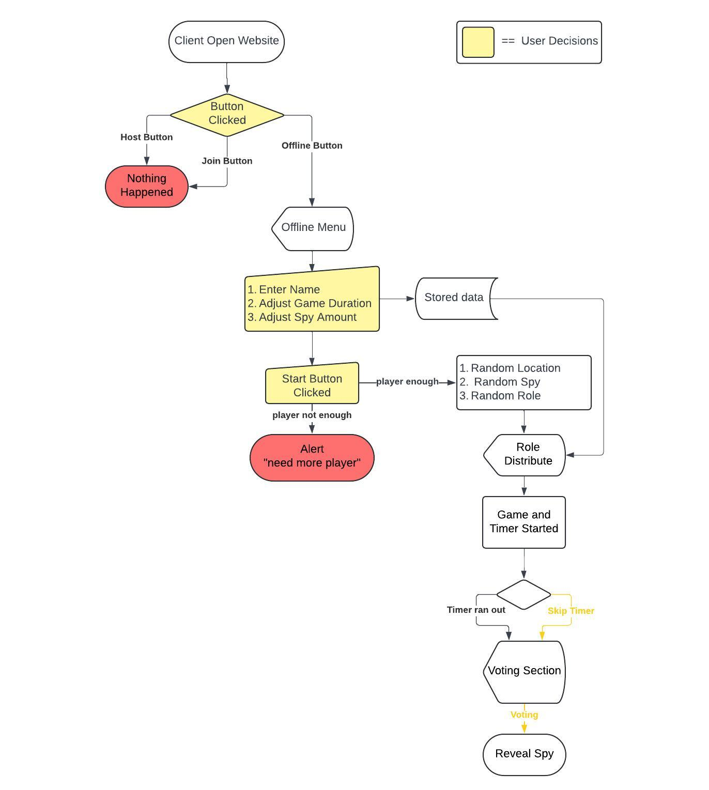
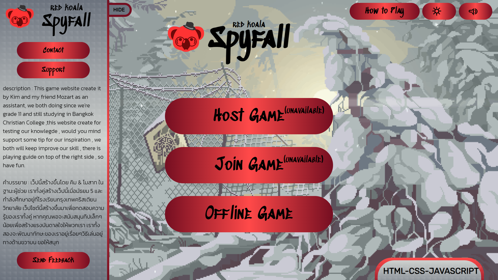
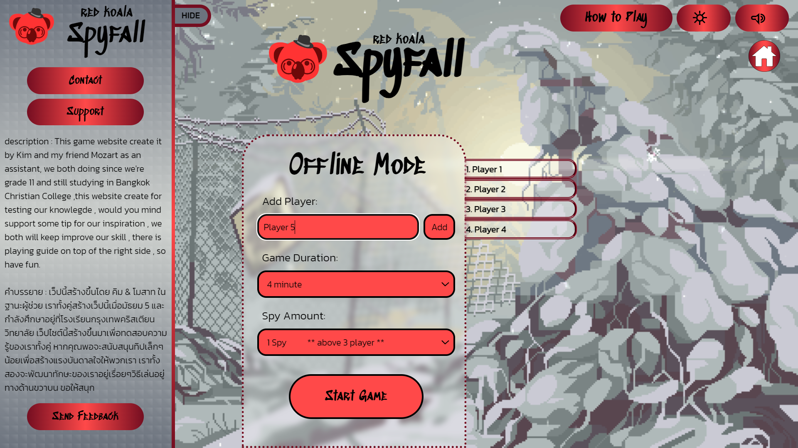
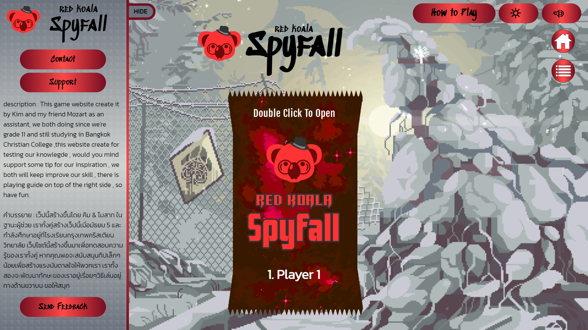
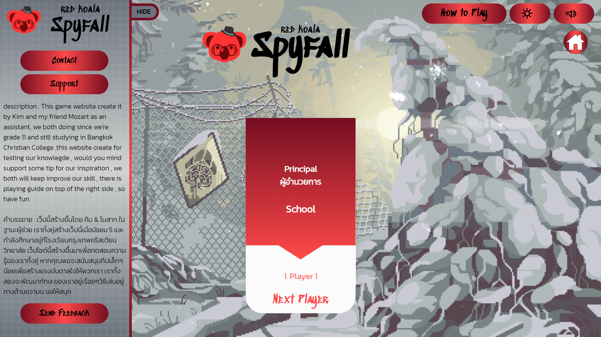
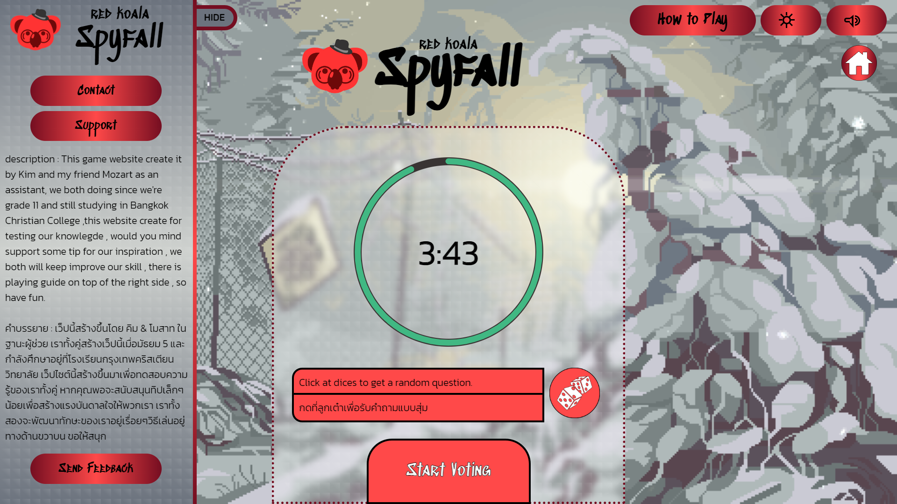
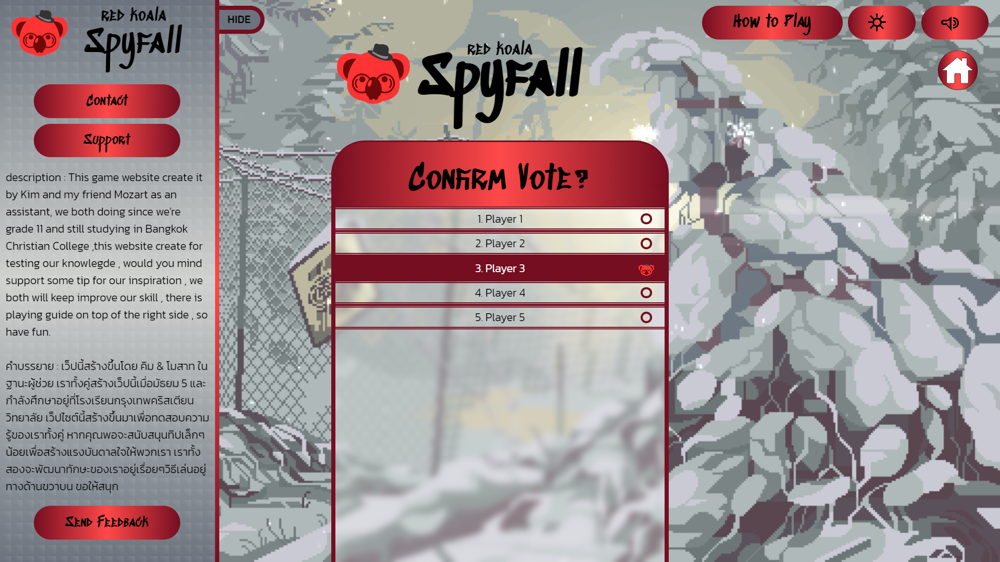

# Red Koala Spyfall

### What is Red Koala Spyfall?
**Red Koala Spyfall** is a social deduction game where players ask each other questions to uncover the spy among them, spy must figure out the location without revealing their identity. This website was inspired by the Spyfall board game ,that is why the rules are mostly similar. Also, this is my first project on my programming journey ,there must be a few bugs, so please understand. 
   
**Red Koala Spyfall** เป็นเกมการสืบสวนโดยที่ผู้เล่นจะถามคำถามกันเองเพื่อค้นหาสปายในกลุ่ม ซึ่งสปายจะต้องค้นหาตำแหน่งของที่อยู่ปัจจุบันให้ได้โดยไม่ต้องเปิดเผยตัวตน เว็บไซต์นี้ได้รับแรงบันดาลใจจากบอร์ดเกมอย่าง Spyfall ทำให้กฎส่วนใหญ่จึงคล้ายกัน นอกจากนี้นี่เป็นโปรเจ็กต์แรกของผมในการเดินทางด้านการเขียนโปรแกรม โดยที่เว็บนี้ต้องมีบัคอยู่บ้าง โปรดเข้าใจด้วยนะครับ😊
 
 
 
### Method
This game has a host, join, and offline button, but only the offline button works because this website is hosted by a client because my skill isn't that far. After clicking the offline button, you can input your name and your friend's name in it, and then click the start button. The game will randomly choose a location, and then it will randomly give every player a role, including spy. The game begins, and any player can start a question to another player to find a suspicious of spy (there is a random question if you can't figure out the question). And spy need to figure out where the location is from the question that each player is asking before timer ran out.
   
เกมนี้มีปุ่ม host join offline แต่มีเพียงปุ่ม offline เท่านั้นที่ใช้งานได้ เนื่องจากเว็บไซต์นี้โฮสต์โดย client เนื่องจากทักษะของผมยังไม่เก่งมากในตอนนั้น หลังจากคลิกปุ่ม offline จะสามารถป้อนชื่อของคนที่เล่นได้ในนั้น และจากนั้นคลิกปุ่มเริ่มเกมจะเลือกตำแหน่งแบบสุ่ม แล้วจึงจะให้บทบาทให้กับผู้เล่นแต่ละคนแบบสุ่มรวมถึงสปายด้วย และเมื่อเกมเริ่ม ผู้เล่นคนใดก็ตามสามารถเริ่มคำถามกับผู้เล่นคนอื่นเพื่อหาความน่าสงสัยที่จะเป็นสปาย (มีคำถามแบบสุ่มหากคิดคำถามไม่ได้) โดยที่สปายต้องระบุตำแหน่งจากคำถามที่ผู้เล่นแต่ละคนถามให้ได้ก่อนเวลาหมด
 
 
 

### Used Language/Tools

  &nbsp;
  &nbsp;
  &nbsp;

### Flowchart 

  

   

### Website Interface

  
  
  
  
  
  

   
This website is responsive, but there are a few bugs. You can click here to play [Red Koala Spyfall](https://kimmuie.github.io/spyfall/)
